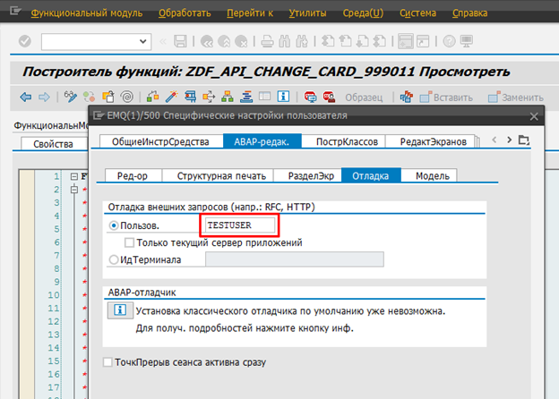

# Useful FMs, function groups, classes
### Working with BAL (Business Application Log)
```abap
CLASS zcl_bs_demo_handle_messages DEFINITION PUBLIC FINAL CREATE PUBLIC.
  PUBLIC SECTION.
    INTERFACES if_oo_adt_classrun.

  PRIVATE SECTION.
    METHODS create_log_entries
      RETURNING VALUE(rd_result) TYPE if_bali_log=>ty_handle
      RAISING   cx_static_check.

    METHODS read_log_entries
      IMPORTING id_id            TYPE if_bali_log=>ty_handle
      RETURNING VALUE(rt_result) TYPE if_bali_log=>ty_item_table
      RAISING   cx_static_check.
ENDCLASS.

CLASS zcl_bs_demo_handle_messages IMPLEMENTATION.
  METHOD if_oo_adt_classrun~main.
    TRY.
        " Log messages and get handle
        DATA(ld_id) = create_log_entries( ).
        out->write( |Log created: { ld_id }| ).

        " Read messages from handle
        DATA(lt_items) = read_log_entries( ld_id ).
        LOOP AT lt_items INTO DATA(ls_item).
          out->write( ls_item-item->get_message_text( ) ).
        ENDLOOP.

      CATCH cx_root INTO DATA(lo_err).
        out->write( lo_err->get_longtext( ) ).
    ENDTRY.
  ENDMETHOD.

  METHOD create_log_entries.
    " Create log object
    DATA(lo_log) = cl_bali_log=>create( ).

    " Create and set header
    DATA(lo_header) = cl_bali_header_setter=>create( object      = 'ZBS_DEMO_LOG_OBJECT'
                                                     subobject   = 'TEST'
                                                     external_id = cl_system_uuid=>create_uuid_c32_static( ) ).

    lo_header->set_expiry( expiry_date       = CONV #( cl_abap_context_info=>get_system_date( ) + 7 )
                           keep_until_expiry = abap_true ).
    
    lo_log->set_header( lo_header ).

    " System message
    MESSAGE s001(zbs_demo_log) INTO DATA(ld_message).
    lo_log->add_item( cl_bali_message_setter=>create_from_sy( ) ).

    " Free text
    DATA(lo_free) = cl_bali_free_text_setter=>create( severity = if_bali_constants=>c_severity_warning
                                                      text     = 'Execution terminated, dataset not found' ).
    lo_log->add_item( lo_free ).

    " Exception
    DATA(lo_exc) = cl_bali_exception_setter=>create( severity  = if_bali_constants=>c_severity_error
                                                     exception = NEW cx_sy_zerodivide( ) ).
    lo_log->add_item( lo_exc ).

    " Classic Message
    DATA(lo_msg) = cl_bali_message_setter=>create(
        severity   = if_bali_constants=>c_severity_status
        id         = 'ZBS_DEMO_LOG'
        number     = '002'
        variable_1 = CONV #( cl_abap_context_info=>get_user_business_partner_id( ) ) ).
    lo_log->add_item( lo_msg ).

    " BAPIRET2
    DATA(lo_bapi) = cl_bali_message_setter=>create_from_bapiret2( VALUE #( type       = 'E'
                                                                           id         = 'ZBS_DEMO_LOG'
                                                                           number     = '002'
                                                                           message_v1 = 'Dummy' ) ).
    lo_log->add_item( lo_bapi ).

    " Save logs
    cl_bali_log_db=>get_instance( )->save_log( lo_log ).

    " Get the handle
    rd_result = lo_log->get_handle( ).
  ENDMETHOD.

  METHOD read_log_entries.
    DATA(lo_log_db) = cl_bali_log_db=>get_instance( ).

    DATA(lo_log) = lo_log_db->load_log( id_id ).

    rt_result = lo_log->get_all_items( ).
  ENDMETHOD.
ENDCLASS.
```

### Работа с фронтэндом
```abap
CLASS cl_gui_frontend_services DEFINITION LOAD.
  CALL METHOD cl_gui_frontend_services=>get_temp_directory
    CHANGING
      temp_dir     = lv_path
    EXCEPTIONS
      cntl_error   = 1
      error_no_gui = 2
      OTHERS       = 3.
```

### Работа с ZIP-архивами
Класс: `CL_ABAP_ZIP`

### Утилиты для HTTP
Класс: `CL_HTTP_UTILITY`

### HTTP-client
```abap
DATA: lv_message_v1 TYPE symsgv,
      lv_message_v2 TYPE symsgv,
      lv_message_v3 TYPE symsgv,
      lv_message_v4 TYPE symsgv.

cl_http_client=>create_by_destination(
  EXPORTING
    destination              = mc_destination
  IMPORTING
    client                   = DATA(lo_client)
  EXCEPTIONS
    argument_not_found       = 1                                      " Connection Parameter (Destination) Not Available
    destination_not_found    = 2                                      " Destination not found
    destination_no_authority = 3                                      " No Authorization to Use HTTP Destination
    plugin_not_active        = 4                                      " HTTP/HTTPS communication not available
    internal_error           = 5                                      " Internal error (e.g. name too long)
    OTHERS                   = 6 ).

IF sy-subrc <> 0.
  IF 1 = 2. MESSAGE e003(zsd_dtp_common). ENDIF.
  APPEND VALUE #( type       = mc_message-error
                  id         = mc_message-zsd_dtp_common_id
                  number     = '003' )                                " Failed to create http-client by destination.
                  TO ct_messages.
  APPEND is_nast TO ct_failed.
  RETURN.
ENDIF.

LOOP AT is_nast-data_event ASSIGNING FIELD-SYMBOL(<fs_data_event>) WHERE document_content IS NOT INITIAL.
  lo_client->request->set_method( if_http_request=>co_request_method_post ).
  lo_client->request->set_content_type( content_type = 'application/json' ).

  DATA(lv_body_request) = /ui2/cl_json=>serialize(
        data        = VALUE ts_body_request( root-data_event = <fs_data_event> )
        compress    = abap_true
        pretty_name = /ui2/cl_json=>pretty_mode-low_case ).

  lo_client->request->set_cdata( data = lv_body_request ).

  lo_client->send(
    EXCEPTIONS
      http_communication_failure = 1                                    " Communication Error
      http_invalid_state         = 2                                    " Invalid state
      http_processing_failed     = 3                                    " Error when processing method
      http_invalid_timeout       = 4                                    " Invalid Time Entry
      OTHERS                     = 5 ).

  IF sy-subrc <> 0.
    IF 1 = 2. MESSAGE e004(zsd_dtp_common). ENDIF.
    APPEND VALUE #( type       = mc_message-error
                    id         = mc_message-zsd_dtp_common_id
                    number     = '004' )                                " Failed to send request.
                    TO ct_messages.
    APPEND is_nast TO ct_failed.
    RETURN.
  ENDIF.

  lo_client->receive(
    EXCEPTIONS
      http_communication_failure = 1                                    " Communication Error
      http_invalid_state         = 2                                    " Invalid state
      http_processing_failed     = 3                                    " Error when processing method
      OTHERS                     = 4  ).

  IF sy-subrc <> 0.
    IF 1 = 2. MESSAGE e005(zsd_dtp_common). ENDIF.
    APPEND VALUE #( type       = mc_message-error
                    id         = mc_message-zsd_dtp_common_id
                    number     = '005' )                                " Failed to receive response.
                    TO ct_messages.
    APPEND is_nast TO ct_failed.
    RETURN.
  ENDIF.

  lo_client->response->get_status(
    IMPORTING
      code   = DATA(lv_status)
      reason = DATA(lv_reason) ).

  IF 1 = 2. MESSAGE i006(zsd_dtp_common). ENDIF.
  APPEND VALUE #( type       = mc_message-info
                  id         = mc_message-zsd_dtp_common_id
                  number     = '006'                                   " Status code: &1 - &2.
                  message_v1 = condense( CONV string( lv_status ) )
                  message_v2 = lv_reason )
                  TO ct_messages.

  DATA(lv_body_response) = lo_client->response->get_cdata( ).

  IF lv_status <> cl_rest_status_code=>gc_success_ok.
    lo_client->get_last_error(
      IMPORTING
        code    = DATA(lv_code)
        message = DATA(lv_message) ).

    IF lv_code IS NOT INITIAL.
      IF 1 = 2. MESSAGE e007(zsd_dtp_common). ENDIF.
      APPEND VALUE #( type       = mc_message-error
                      id         = mc_message-zsd_dtp_common_id
                      number     = '007'                                " Error code: &1 - &2.
                      message_v1 = lv_code
                      message_v2 = lv_message )
                      TO ct_messages.
    ENDIF.

    IF lv_body_response IS NOT INITIAL.
      TRY.
          lv_message_v1 = lv_body_response.
          lv_message_v2 = lv_body_response+50.
          lv_message_v3 = lv_body_response+100.
          lv_message_v4 = lv_body_response+150.
        CATCH cx_sy_range_out_of_bounds.
      ENDTRY.

      IF strlen( lv_message_v4 ) = 50.
        lv_message_v4 = lv_message_v4(47) && '...'.
      ENDIF.

      IF 1 = 2. MESSAGE e000(zsd_dtp_common). ENDIF.
      APPEND VALUE #( type       = mc_message-error
                      id         = mc_message-zsd_dtp_common_id
                      number     = '000'
                      message_v1 = lv_message_v1
                      message_v2 = lv_message_v2
                      message_v3 = lv_message_v3
                      message_v4 = lv_message_v4 )
                      TO ct_messages.
    ENDIF.

    " Agreement with KGS Team:
    " There may be correctly processed messages with 500 status code, e.g.
    " when sending duplicate messages
    IF lv_status <> cl_rest_status_code=>gc_server_error_internal.
      APPEND is_nast TO ct_failed.
    ENDIF.
  ENDIF.
ENDLOOP.
```

### Константы для message types
Интерфейс: `IF_XO_CONST_MESSAGE`

### Строковые переменные
`CL_ABAP_CHAR_UTILITIES=>CR_LF`
```abap
DATA: lv_c_nbcp TYPE c. 
lv_c_nbsp = cl_abap_conv_in_ce=>uccp( '00A0' ). "non-breaking space

IF cl_abap_matcher=>matches( pattern = '\d{23}'
                                text = l_string ) = abap_true.
   CONCATENATE l_string+0(9)
               l_string+9(4)
               l_string+13
          INTO l_string SEPARATED BY  gc_sep_dat.
ENDIF.
```

### Красивый вывод сообщений
```abap
CALL FUNCTION 'C14Z_MESSAGES_SHOW_AS_POPUP'
      TABLES
        i_message_tab = gt_messages.
```

### Чтение данных из документа Excel
ФМ `ALSM_EXCEL_TO_INTERNAL_TABLE`

### Конвертация между XSTRING и BINARY и пр.
Группа функций `SCMS_CONV`

### Получение метаданных
```abap
*&---------------------------------------------------------------------*
*&      Form  get_text_from_domain
*&---------------------------------------------------------------------*
*       Текст для постоянных значений домена
*----------------------------------------------------------------------*
FORM get_text_from_domain
         USING iv_value   TYPE any
         CHANGING ch_text TYPE any.

  DATA:
    li_tdescr TYPE REF TO cl_abap_typedescr ,
    li_edescr TYPE REF TO cl_abap_elemdescr ,
    lv_name   TYPE ddobjname ,
    ls_dd07v  TYPE dd07v ,
    lt_dd07v  TYPE STANDARD TABLE OF dd07v ,
    ls_dd04v  TYPE dd04v.

  CLEAR: ch_text.

* по ссылке - получаем элемент данных
  CALL METHOD cl_abap_datadescr=>describe_by_data
    EXPORTING
      p_data      = iv_value
    RECEIVING
      p_descr_ref = li_tdescr.

  li_edescr ?= li_tdescr.
  lv_name = li_edescr->help_id.

* по элементу данных - получаем домен
  CALL FUNCTION 'DDIF_DTEL_GET'
    EXPORTING
      name          = lv_name
      state         = 'A'
      langu         = ' '
    IMPORTING
      dd04v_wa      = ls_dd04v
    EXCEPTIONS
      illegal_input = 1
      OTHERS        = 2.

  CHECK sy-subrc EQ 0.
  lv_name = ls_dd04v-domname.

* получаем постоянные значения этого домена
  CALL FUNCTION 'DDIF_DOMA_GET'
    EXPORTING
      name          = lv_name
      langu         = sy-langu
    TABLES
      dd07v_tab     = lt_dd07v
    EXCEPTIONS
      illegal_input = 1
      OTHERS        = 2.

* среди них ищем текстовку к заданному значению
  CHECK sy-subrc EQ 0.
  READ TABLE lt_dd07v INTO ls_dd07v
    WITH KEY domvalue_l = iv_value.
  IF sy-subrc = 0.
    ch_text = ls_dd07v-ddtext.
  ENDIF.
ENDFORM.
```

### Перевод сумм во внутреннее представление
```abap
CALL FUNCTION 'BAPI_CURRENCY_CONV_TO_INTERN_9'
  EXPORTING
    currency             = ls_rest_partners-cn_waers
    amount_external      = lv_bapi_sum
    max_number_of_digits = 15
  IMPORTING
    amount_internal      = ls_rest_partners-cn_amount.
```

### Работа с курсами валют
[Link](http://www.sapnet.ru/viewtopic.php?t=103&highlight=currency+rate)

### Запуск транзакции через ФМ
```abap
CALL FUNCTION 'ABAP4_CALL_TRANSACTION'
  EXPORTING
    tcode                   = ev_tcode
    skip_screen             = abap_true
  TABLES
    spagpa_tab              = et_spagpa
  EXCEPTIONS
    call_transaction_denied = 1
    tcode_invalid           = 2
    OTHERS                  = 3.
```

### Генерация случайных чисел
```abap
DATA(lo_rand)  = cl_abap_random=>create( seed = cl_abap_random=>seed( ) ).
DATA(lv_value) = lo_rand->intinrange( low = 1 high = 10 ).
```

### Регулярные выражения
[Link](http://abap4.ru/regular-expression.html)
```abap
IF cl_abap_matcher=>matches( pattern = '\d{23}'
                                text = l_string ) = abap_true.
     CONCATENATE l_string+0(9)
                 l_string+9(4)
                 l_string+13 l_string SEPARATED BY gc_sep_dat.
ENDIF.
```
```abap
METHOD convert_filter_string.
  DATA: lv_pcre  TYPE string,
        lv_field TYPE string.

  rv_filter_string = iv_filter_string.

  " substringof ( 'VALUE' , FIELD ) --> FIELD like '%VALUE%'
  REPLACE ALL OCCURRENCES OF PCRE `(substringof\s*\(\s*)'(.*?)'\s*,\s*(\S*)\s*\)`
                               IN rv_filter_string
                             WITH `$3 like '%$2%'`
                             IGNORING CASE ##NO_TEXT.

  " startswith ( FIELD, 'VALUE' ) --> FIELD like 'VALUE%'
  REPLACE ALL OCCURRENCES OF PCRE `(startswith\s*\(\s*)(\S*)\s*,\s*'(.*?)'\s*\)`
                               IN rv_filter_string
                             WITH `$2 like '$3%'`
                             IGNORING CASE ##NO_TEXT.

  " endswith ( FIELD, 'VALUE' ) --> FIELD like '%VALUE'
  REPLACE ALL OCCURRENCES OF PCRE `(endswith\s*\(\s*)(\S*)\s*,\s*'(.*?)'\s*\)`
                               IN rv_filter_string
                             WITH `$2 like '%$3'`
                             IGNORING CASE ##NO_TEXT.

  " eq null --> is null
  REPLACE ALL OCCURRENCES OF PCRE `eq\s*null`
                               IN rv_filter_string
                             WITH `is null`
                             IGNORING CASE ##NO_TEXT.

  " ne null --> is not null
  REPLACE ALL OCCURRENCES OF PCRE `ne\s*null`
                               IN rv_filter_string
                             WITH `is not null`
                             IGNORING CASE ##NO_TEXT.

  LOOP AT it_fields_date INTO lv_field.
    IF lv_field IS NOT INITIAL.
      " DateField is null --> ( DateField is null ) or ( DateField eq '00000000' )
      lv_pcre = `(` && lv_field && `)\s*is\s*null`.
      REPLACE ALL OCCURRENCES OF PCRE lv_pcre
                                   IN rv_filter_string
                                 WITH `( $1 is null ) or ( $1 eq '00000000' )`
                                 IGNORING CASE ##NO_TEXT.

      " DateField is not null --> ( DateField is not null ) and ( DateField ne '00000000' )
      lv_pcre = `(` && lv_field && `)\s*is\s*not\s*null`.
      REPLACE ALL OCCURRENCES OF PCRE lv_pcre
                                   IN rv_filter_string
                                 WITH `( $1 is not null ) and ( $1 ne '00000000' )`
                                 IGNORING CASE ##NO_TEXT.
    ENDIF.
  ENDLOOP.

  " AlphaField eq '12345' --> AlphaField eq '0000012345'
  LOOP AT it_fields_alpha INTO DATA(ls_alpha).
    DATA(lv_offset) = 0.
    DATA(lv_length) = 0.

    lv_pcre = |({ ls_alpha-field }.*?)'(.*?)'|.

    DO.
      FIND FIRST OCCURRENCE OF PCRE lv_pcre
                                 IN SECTION OFFSET lv_offset OF rv_filter_string
                         SUBMATCHES DATA(lv_sub1) DATA(lv_sub2)
                              MATCH OFFSET lv_offset
                           IGNORING CASE.
      IF sy-subrc <> 0.
        EXIT.
      ENDIF.

      DATA(lv_with) = |$1'{ condense( |{ lv_sub2 ALPHA = IN WIDTH = ls_alpha-width }| ) }'|.

      REPLACE FIRST OCCURRENCE OF PCRE lv_pcre
                                    IN SECTION OFFSET lv_offset OF rv_filter_string
                                  WITH lv_with
                           REPLACEMENT LENGTH lv_length
                              IGNORING CASE.
      lv_offset += lv_length.
    ENDDO.
  ENDLOOP.
ENDMETHOD.
```

### ADBC и Native SQL
```abap
TRY.
    DATA(lv_sql) = |SELECT spfli.carrid, spfli.connid|
                && |  FROM spfli|
                && |  WHERE spfli.mandt = '{ sy-mandt }' AND spfli.carrid = '{ p_carid }'|.

    DATA(lo_con) = cl_sql_connection=>get_connection( ).
    DATA(lo_sql) = lo_con->create_statement( ).
    DATA(lo_result) = lo_sql->execute_query( lv_sql ).

    GET REFERENCE OF lt_spfli INTO lr_spfli.
    lo_result->set_param_table( lr_spfli ).
    lo_result->next_package( ).
    lo_result->close( ).
    lo_con->close( ).

  CATCH cx_sql_exception INTO DATA(lx_sql_exc).
    DATA(lv_text) = lx_sql_exc->get_text( ).
    MESSAGE lv_text TYPE 'S' DISPLAY LIKE 'E'.
ENDTRY.
```

### Работа с HASH-значением
Function group: `SECH`

### Работа с GUID (UUID)
Class: `CL_SYSTEM_UUID`

### Error raising in OData service
```abap
/iwbep/if_mgw_conv_srv_runtime~get_message_container( )->add_message_text_only(
                                                          iv_msg_type = if_msg_output=>msgtype_error
                                                          iv_msg_text = text-e01 ).
" Raising Exception
RAISE EXCEPTION TYPE /iwbep/cx_mgw_busi_exception
  EXPORTING
    textid            = /iwbep/cx_mgw_busi_exception=>business_error
    message_container = /iwbep/if_mgw_conv_srv_runtime~get_message_container( )
    http_status_code  = CONV #( if_http_status=>reason_400 ).
```          

### Dynamic programming
- Command `SYNTAX-CHECK`
- Class `CL_ABAP_DYN_PRG`

### Virus scan
Class `CL_VSI`

### Progress indicator
```abap
cl_progress_indicator=>progress_indicate(
    i_text = |Processing: { current_record }/{ total_records }|
    i_output_immediately = abap_true ).
```

# Работа с Excel
OLE: `zcl_edms_xls_epam_fi`, пример использования `ZFICO_DOCS_UPLOAD_F01`, `upload_excel_file`.
Минус: требует компьютер пользователя с Windows, могут быть проблемы при запуске из web
Особенность: работает только с тем, что видно на экране

Фон: `zcl_fc_excel_reader`, пример использования: `ZCL_EDMS_MASS_EPAM_FI_MULTI=>PARSE_INTERNAL()`.
Плюсы: можно работать в фоне, с несколькими вкладками
Минусы: не работает с xls-форматом (старый), не позволяет определить активную вкладку, считывает всю вкладку, вне зависимости от наличия скрытых строк.

Ещё есть `cl_xlsx_document`, но я в ней не разобрался, нет времени.
Пример попытки: `ZCL_FC_EXCEL_READER=>PREPARE`, закомментированные строки 22-30.

Есть ещё abap2xls: пакет `ZABAP2XLSX`.
На сапборде есть xslx worbench Бородина и zwww (через олей) Parazit'а. И что-то ещё, нужно рыться.
Ещё есть iXML, вроде бы можно заюзать совместно с `zcl_zip` (или как его там).

# Дата / время
### Прибавить количество секунд к дате и времени
```abap
CALL FUNCTION 'TSTR_CALC_TIME'
  EXPORTING
    iv_begin_datelocal_req   = '2000101'
    iv_begin_timelocal_req   = '000000'
    iv_duration_integer      = lv_secs
  IMPORTING
    ev_end_datelocal         = lv_next_date
    ev_end_timelocal         = lv_next_time
  EXCEPTIONS
    fatal_error              = 1
    time_invalid             = 2
    time_missing             = 3
    tstream_not_loadable     = 4
    tstream_generation_error = 5
    parameter_error          = 6
    unspecified_error        = 7
    OTHERS                   = 8.
```

### Последний день месяца
```abap
CALL FUNCTION 'DATE_GET_MONTH_LASTDAY'
    EXPORTING
      i_date = sy-datum
    IMPORTING
      e_date = lv_date.
```

### Работа с timestamp
```abap
GET TIME STAMP FIELD DATA(lv_ts).
DATA: lv_timestamp TYPE timestamp.

cl_abap_tstmp=>systemtstmp_syst2utc(
   EXPORTING
      syst_date = sy-datum
      syst_time = sy-uzeit
   IMPORTING
      utc_tstmp = lv_timestamp ).

CONVERT TIME STAMP lv_timestamp TIME ZONE 'UTC' INTO DATE DATA(lv_date) TIME DATA(lv_time).
```

### Классы для работы с датами
- `CL_ABAP_DATFM`

# Экраны
### Чтение / запись данных с экрана
- `DYNP_VALUES_READ`
- `DYNP_VALUES_UPDATE`

### F4 для поля из таблицы
```abap
CALL FUNCTION 'F4IF_FIELD_VALUE_REQUEST'
    EXPORTING
      tabname           = 'SWOTENTRY'
      fieldname         = 'OBJTYPE'
    TABLES
      return_tab        = gt_ret_tab[]
    EXCEPTIONS
      field_not_found   = 1
      no_help_for_field = 2
      inconsistent_help = 3
      no_values_found   = 4
      OTHERS            = 5.
```

### Установить свой список значений для ListBox
```abap
DATA: lt_vrm_values TYPE vrm_values,
ls_vrm_values LIKE LINE OF lt_vrm_values.

ls_vrm_values-key  = 'FULL'.
ls_vrm_values-text = 'Полная налоговая ставка'.
APPEND ls_vrm_values TO lt_vrm_values.

ls_vrm_values-key  = 'FULL_20'.
ls_vrm_values-text = 'Полная налоговая ставка 20%'.
APPEND ls_vrm_values TO lt_vrm_values.

CALL FUNCTION 'VRM_SET_VALUES'
  EXPORTING
    id                = 'ZDF_CARD_999011-TAXGROUP'
    values          = lt_vrm_values
  EXCEPTIONS
    id_illegal_name = 1
    OTHERS            = 2.
```

# ALV
### Разворачивание ALV на полный экран
Программа `ZDF_FIND_CARD_999011`, `FORM init_alv`

### Простой вывод в ALV (1)
```abap
DATA: lr_alv TYPE REF TO cl_salv_table,
      lr_functions TYPE REF TO cl_salv_functions_list.

cl_salv_table=>factory( IMPORTING r_salv_table = lr_alv
                         CHANGING t_table = lt_data ).

lr_functions = lr_alv->get_functions( ).
lr_functions->set_all( ).

lr_alv->display( ).
```

### Простой вывод в ALV (2)
```abap
DATA(lo_ida) = cl_salv_gui_table_ida=>create( iv_table_name = 'ZTVLT_CRDNTL' ).

lo_ida->field_catalog( )->get_available_fields( IMPORTING ets_field_names = DATA(lt_fc) ).
DELETE lt_fc WHERE table_line EQ 'PWD'.
lo_ida->field_catalog( )->set_available_fields( lt_fc ).

lo_ida->fullscreen( )->display( ).
```

### Сброс буфера ALV-таблиц для всех системы
Программа `BALVBUFDEL`

# Классы
### Вызов исключений
```abap
TRY.
    DATA(lv_uuid) = cl_uuid_factory=>create_system_uuid( )->create_uuid_x16( ).
  CATCH cx_uuid_error INTO DATA(lo_uuid_error).
    RAISE EXCEPTION TYPE /iwbep/cx_mgw_busi_exception
      EXPORTING
        textid            = /iwbep/cx_mgw_busi_exception=>business_error_unlimited
        previous          = lo_uuid_error
        message_unlimited = lo_uuid_error->get_longtext( ).
ENDTRY.
```

### Standard exception classes
- `cx_root`
  - `cx_sy_arithmetic_error`
    - `cx_sy_arithmetic_overflow`
    - `cx_sy_zerodivide`
  - `cx_sy_itab_line_not_found` 
  - `cx_abap_invalid_value`  
  - `cx_abap_auth_check_exception` 
  - `cx_static_check` 
  - `cx_dynamic_check` 
  - `cx_no_check` 

```abap
RAISE EXCEPTION TYPE cx_abap_invalid_value
  EXPORTING
    value = CONV #( i_carrier_id ).

RAISE EXCEPTION TYPE cx_abap_auth_check_exception
  EXPORTING
    textid = cx_abap_auth_check_exception=>missing_authorization.
```

# Новый синтаксис
### Обход таблицы по группировкам
```abap
LOOP AT lt_data INTO DATA(ls_data)
         GROUP BY ( lifnr   = ls_data-lifnr
                    kunnr   = ls_data-kunnr
                    waers   = ls_data-waers
                    size = GROUP SIZE index = GROUP INDEX )
                  ASCENDING
                  REFERENCE INTO DATA(lr_group).

    REFRESH: lt_data_group.
    LOOP AT GROUP lr_group ASSIGNING FIELD-SYMBOL(<fs_data>).
      lt_data_group = VALUE #( BASE lt_data_group ( <fs_data> ) ).
    ENDLOOP.
ENDLOOP.
```

### Добавление строк в таблицу
```abap
ls_cdata = CORRESPONDING #( BASE ( ls_cdata ) <lfs_contract> 
     MAPPING sap_contract_n = doknr
  	           type = cn_type
  	        subtype = cn_subtype ).

lt_custcontr = CORRESPONDING #( BASE ( lt_vendcontr ) lt_cdata ).
```

### Простое alpha-преобразование
```abap
lv_kunnr = |{ gs_debitor-kunnr ALPHA = OUT }|.
```

### Работа с циклом FOR
```abap
gt_output = VALUE #( FOR <ls_initial_data> IN gt_initial_data ( fill_line( <ls_initial_data> ) ) ) .

DATA(ltr_matnr) = VALUE range_t_matnr( FOR <ls_bom_preview> IN lt_bom_preview_tab
                                         ( sign   = 'I'
                                           option = 'EQ'
                                           low    = CONV #( <ls_bom_preview>-matnr ) ) ).

DATA(lt_mseg_anla2) = VALUE ty_mseg( FOR ls_mseg IN gt_mseg WHERE ( anln1 IS NOT INITIAL ) ( ls_mseg ) ).
```

### Проверка наличия значения в таблице
```abap
IF line_exists( lt_dfs_filedata[ doctype = gc_doctype_51 ] ).
  CONTINUE.
ENDIF.
```

### Условие
```abap
<ls_data>-new_site = COND #( WHEN <ls_data>-cn_beg_date >= s_repdat-low THEN abap_true
                                                                        ELSE abap_false ).

<ls_data>-cn_revise_ao_dfs = COND #( WHEN ( lv_amnt - lv_measvalue ) 
                                       BETWEEN ( -1 * lc_ao_dfs_err ) AND lc_ao_dfs_err THEN icon_led_green
                                      		                                              ELSE icon_led_red ).
DATA(addrnumber) = SWITCH #( <ls_data>-zzre_obj_one_sid 
                      WHEN 1 THEN <ls_data>-addrnumber1
                      WHEN 2 THEN <ls_data>-addrnumber2
                      WHEN 3 THEN <ls_data>-addrnumber3
                      ELSE '' ).
```

### Расчет суммы по колонке таблицы
```abap
DATA: itab TYPE TABLE OF i WITH EMPTY KEY.
itab = VALUE #( FOR j = 1 WHILE j <= 10 ( j ) ).
DATA(sum) = REDUCE i( INIT x = 0 FOR wa IN itab NEXT x = x + wa ).
```

### Создание булевой переменной
```abap
DATA(result) = xsdbool( is_filled  = abap_true AND
                        is_working = abap_true ).
```

# Прочее
### ABAP DEMO package
`SABAPDEMOS`

### ABAP Git
`ZABAPGIT_STANDALONE`

### FICO common packages
- `ZFICO_BC`
- `ZLIB`

### Редактирование таблиц в продуктиве
- `ZRK_SE16N` – редактирование таблиц в продуктиве
- `SE37` - FM `SE16N_INTERFACE`

### Печатные формы OAER, ZOAER
**Функциональный модуль:** `Z_OUT_DOT`, `Z_OUT_XLS`

- Приложение: `kappl`
- Документ:   `kschl`

**Транзакция редактирования:** `ZOAER`

**Транзакция создания видов выходных документов:** `NACT` (`NACE`)
- Имя класса: `classname`
- Тип класса: `classtype`
- Ключ объекта: `object_key`

**Транзакция редактирования:** `OAER`

**Создание нового класса:** тр. `SBDSV1`

### Поиск во всех текстах
- Программа `RS_ABAP_SOURCE_SCAN`
- Транзакция `CODE_SCANNER`

### Отладка фоновых заданий
`jdbg`

### Отладка под другим пользователем
1.	Пользователь, который совершает отладку, должен установить точку останова под другим пользователем.
   
    

2.	Пользователь, под которым происходит отладка, запускает команду `/hext user = EXTUSERNAME`.

### Создание системных вариантов
- `CUS&` - пользовательские транзакции
- `SAP&` - страндартные транзакции

### Работа с командами операционной системы
Создание команды – тр. `SM69`
```abap
CALL 'C_SAPGPARAM' ID 'NAME'  FIELD 'SAPDBHOST'
                   ID 'VALUE' FIELD  lv_param.

lv_command = 'ZOR_PING'.
lv_param   = |-c{ pv_count } { lv_param }|.

CALL FUNCTION 'SXPG_COMMAND_EXECUTE'
  EXPORTING
    commandname                   = lv_command
    additional_parameters         = lv_param
    operatingsystem               = 'ANYOS'
  IMPORTING
    status                        = lv_status
    exitcode                      = lv_exitcode
  TABLES
    exec_protocol                 = lt_protocol
  EXCEPTIONS
    no_permission                 = 1
    command_not_found             = 2
    parameters_too_long           = 3
    security_risk                 = 4
    wrong_check_call_interface    = 5
    program_start_error           = 6
    program_termination_error     = 7
    x_error                       = 8
    parameter_expected            = 9
    too_many_parameters           = 10
    illegal_command               = 11
    wrong_asynchronous_parameters = 12
    cant_enq_tbtco_entry          = 13
    jobcount_generation_error     = 14
    OTHERS                        = 15.

LOOP AT lt_protocol ASSIGNING FIELD-SYMBOL(<ls_protocol>).
  WRITE <ls_protocol>.
ENDLOOP.
```

### Добавление EXTENSION в ФМ BAPI_ACC_DOCUMENT_POST
FIBF – Параметры настройки – Модули процесса клиента

Процесс `RWBAPI01`

### Массовая активация CDS
Program `RUTDDLSACT`

### Массовая проверка синтаксиса
T-code `REDSRS01`

### Изменение цветов в Smartform’е (PDF)
```abap
DATA(control_param) = VALUE ssfctrlop( no_dialog = abap_true
                                          getotf = abap_true ).

DATA(output_options) = VALUE ssfcompop( tdprinter = 'PDF1' ).

CALL FUNCTION fm_name
  EXPORTING
    control_parameters = control_param
    output_options     = output_options
    order_data         = im_s_sales_order
  IMPORTING
    job_output_info    = job_out
  EXCEPTIONS
    formatting_error   = 1
    internal_error     = 2
    send_error         = 3
    user_canceled      = 4
    OTHERS             = 5.

lt_otf = job_out-otfdata.

LOOP AT lt_otf ASSIGNING FIELD-SYMBOL(<ls_otf>) WHERE tdprintcom = 'CT' OR tdprintcom = 'CB'.
  "Change caption text and section title background colors
  IF <ls_otf>-tdprintpar = '7DA6CF00'.
    <ls_otf>-tdprintpar = '3052A200'.
  ENDIF.

  "Change regular text color
  IF <ls_otf>-tdprintpar = '00000000' AND <ls_otf>-tdprintcom = 'CT'.
    <ls_otf>-tdprintpar = '00003100'.
  ENDIF.

  "Change frame color
  IF <ls_otf>-tdprintpar = 'ABC7DE00' AND <ls_otf>-tdprintcom = 'CB'.
    <ls_otf>-tdprintpar = 'EAEEF600'.
  ENDIF.

  "Change input fields color
  IF <ls_otf>-tdprintpar = 'D4D4D400' AND <ls_otf>-tdprintcom = 'CB'.
    <ls_otf>-tdprintpar = 'EAEEF600'.
  ENDIF.

  "Change logo colors
  IF <ls_otf>-tdprintpar = '1535FF00' AND <ls_otf>-tdprintcom = 'CT'.
    <ls_otf>-tdprintpar = '103F6B00'.
  ENDIF.
  IF <ls_otf>-tdprintpar = '1589FF00' AND <ls_otf>-tdprintcom = 'CT'.
    <ls_otf>-tdprintpar = '63B5E500'.
  ENDIF.
ENDLOOP.

CALL FUNCTION 'CONVERT_OTF'
  EXPORTING
    format                = 'PDF'          " Target format for LINES table
  IMPORTING
    bin_file              = re_v_xstring_pdf
  TABLES
    otf                   = lt_otf         " Input table with OTF format
    lines                 = lines          " Output table with target format
  EXCEPTIONS
    err_max_linewidth     = 1              " Line width must be between 2 and 132
    err_format            = 2              " Format not supported
    err_conv_not_possible = 3              " Conversion not possible/supported
    err_bad_otf           = 4
    OTHERS                = 5.
```

# OData
### Преобразование Filter string в select-options
`CL_CLB2_TOOLS=>ODATA_FILTER2SELECT_OPTION`

### Преобразование select-options в WHERE-condition
```abap
CALL FUNCTION 'SE16N_CREATE_SELTAB'
    TABLES
      lt_sel   = gt_sel
      lt_where = gt_where.
```

# UI5
### Загрузка / выгрузка репозитория
Program `/UI5/UI5_REPOSITORY_LOAD`
